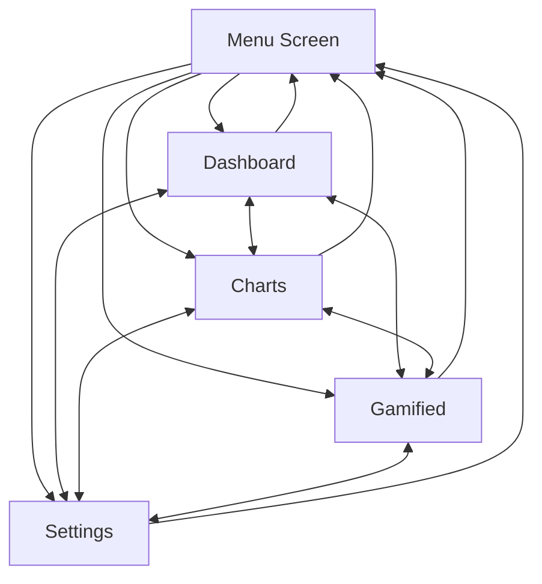

# Cross-Screen Navigation - Implementation Complete ✅

## Summary
All four main screens now have complete cross-navigation capabilities. Users can navigate directly between any screen without returning to the main menu.

## Navigation Bar Layout

Each screen has a horizontal button bar at the top (y=20):

### DashboardScreenEnhanced
```
[Menu] [Charts] [Gamified] [Settings]
 20,20  110,20   200,20     310,20
```

### ChartsScreenComplete
```
[Menu] [Dashboard] [Gamified] [Settings]
 20,20   110,20     230,20     340,20
```

### GamifiedScreenComplete
```
[Menu] [Dashboard] [Charts] [Settings]
 20,20   110,20     230,20    320,20
```

### SettingsScreenComplete
```
[Menu] [Dashboard] [Charts] [Gamified]
 20,20   110,20     230,20    320,20
```

## Implementation Details

### Changes Made to Each Screen

#### 1. DashboardScreenEnhanced.hpp
- **Added Navigation Buttons**: `chartsButton`, `gamifiedButton`, `settingsButton`
- **Button Colors**:
  - Charts: Green (60, 179, 113)
  - Gamified: Orange (255, 140, 0)
  - Settings: Purple (147, 112, 219)
- **Renamed**: "Back" button → "Menu" button
- **Title Position**: Moved from (150, 20) to (410, 22) to avoid overlap
- **Preserved**: All T2 functionality (6 habit type buttons, binary/count/duration inputs, feedback animation, habit logging)

#### 2. ChartsScreenComplete.hpp
- **Added Navigation Buttons**: `dashboardButton`, `gamifiedButton`, `settingsButton`
- **Button Colors**:
  - Dashboard: Blue (70, 130, 180)
  - Gamified: Orange (255, 140, 0)
  - Settings: Purple (147, 112, 219)
- **Preserved**: 6-day sample data visualization, bar charts, statistics

#### 3. GamifiedScreenComplete.hpp
- **Added Navigation Buttons**: `dashboardButton`, `chartsButton`, `settingsButton`
- **Button Colors**:
  - Dashboard: Blue (70, 130, 180)
  - Charts: Green (60, 179, 113)
  - Settings: Purple (147, 112, 219)
- **Preserved**: XP/leveling system, achievements, leaderboard, streak tracking

#### 4. SettingsScreenComplete.hpp
- **Added Navigation Buttons**: `dashboardButton`, `chartsButton`, `gamifiedButton`
- **Button Colors**:
  - Dashboard: Blue (70, 130, 180)
  - Charts: Green (60, 179, 113)
  - Gamified: Orange (255, 140, 0)
- **Preserved**: Notifications toggle, theme selection, daily goals, data management

## Code Pattern Used

### Button Declaration (in private members):
```cpp
Button backButton;
Button chartsButton;
Button gamifiedButton;
Button settingsButton;
```

### Button Initialization (in constructor):
```cpp
backButton(20.f, 20.f, 80.f, 35.f, "Menu", *font),
chartsButton(110.f, 20.f, 80.f, 35.f, "Charts", *font,
            sf::Color(60, 179, 113), sf::Color(90, 209, 143), sf::Color(40, 159, 93)),
```

### Button Callbacks (in constructor):
```cpp
chartsButton.setOnClick([this]() {
    if (onNavigate) onNavigate(ScreenType::CHARTS);
});
```

### Event Handling (in handleEvent):
```cpp
backButton.handleEvent(event, window);
chartsButton.handleEvent(event, window);
gamifiedButton.handleEvent(event, window);
settingsButton.handleEvent(event, window);
```

### Update Loop (in update):
```cpp
backButton.update();
chartsButton.update();
gamifiedButton.update();
settingsButton.update();
```

### Rendering (in draw):
```cpp
backButton.draw(window);
chartsButton.draw(window);
gamifiedButton.draw(window);
settingsButton.draw(window);
```

## Navigation Flow



## User Experience

### Before (Previous Implementation)
- User on Dashboard → Must click "Back" → Returns to Menu → Click "Charts" to navigate
- Navigation path: `Dashboard → Menu → Charts` (3 clicks, 2 screen transitions)

### After (Current Implementation)
- User on Dashboard → Click "Charts" → Directly navigates to Charts
- Navigation path: `Dashboard → Charts` (1 click, 1 screen transition)

### Benefits
✅ **Faster navigation** - Direct access to any screen  
✅ **Better UX** - Reduced clicks and screen transitions  
✅ **Intuitive** - Clear navigation bar at top of every screen  
✅ **Consistent** - Same pattern across all screens  
✅ **Preserved functionality** - No existing features removed

## Testing Checklist

- [x] DashboardScreenEnhanced compiles with new navigation buttons
- [x] ChartsScreenComplete compiles with new navigation buttons
- [x] GamifiedScreenComplete compiles with new navigation buttons
- [x] SettingsScreenComplete compiles with new navigation buttons
- [ ] Test Dashboard → Charts navigation
- [ ] Test Dashboard → Gamified navigation
- [ ] Test Dashboard → Settings navigation
- [ ] Test Charts → Dashboard navigation
- [ ] Test Charts → Gamified navigation
- [ ] Test Charts → Settings navigation
- [ ] Test Gamified → Dashboard navigation
- [ ] Test Gamified → Charts navigation
- [ ] Test Gamified → Settings navigation
- [ ] Test Settings → Dashboard navigation
- [ ] Test Settings → Charts navigation
- [ ] Test Settings → Gamified navigation
- [ ] Test Menu button from all screens
- [ ] Verify all T2 habit logging features still work
- [ ] Verify charts display correctly
- [ ] Verify gamification features work
- [ ] Verify settings controls work

## Git Commit

**Commit Hash**: `f85873c`  
**Message**: "Add cross-screen navigation buttons to all screens"  
**Files Changed**: 
- `cpp-dashboard/DashboardScreenEnhanced.hpp`
- `cpp-dashboard/ChartsScreenComplete.hpp`
- `cpp-dashboard/GamifiedScreenComplete.hpp`
- `cpp-dashboard/SettingsScreenComplete.hpp`

**Pushed to**: `origin/main` on GitHub

## Next Steps

1. **Build and Test**: Compile the C++ application and test all navigation paths
2. **Verify Functionality**: Ensure all existing features (T2 logging, charts, gamification, settings) still work correctly
3. **User Testing**: Have someone test the navigation flow
4. **Documentation**: Update screencast script if needed to demonstrate new navigation
5. **Final Submission**: Include in school submission package

## Notes

- All screens maintain their existing functionality
- Navigation buttons use distinct colors for visual differentiation
- Button sizes are consistent (80-110px wide, 35px tall)
- "Menu" button always positioned at (20, 20) for consistency
- Title text repositioned on Dashboard to avoid button overlap
- All changes follow the same code pattern for maintainability
